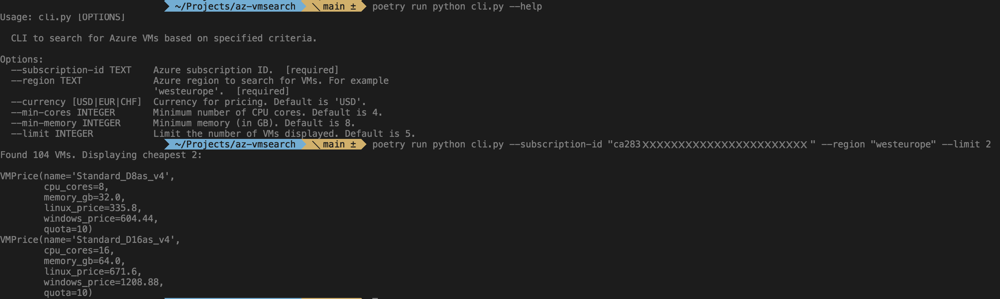

# Azure VM Search Utility

The **Azure VM Search Utility** is a command-line tool designed to help you
find the cheapest VM types for a specific Azure region that are within your
subscription quota.

### How It Works

1. **Fetch Prices**: The tool retrieves VM prices from
   **[cloudprice.net](https://cloudprice.net)**.
2. **Retrieve Quotas**: It uses **az-cli** to gather subscription quotas and
   the available VM types in the specified region.
3. **Mapping**: VM types are mapped to VM families to determine the cheapest
   options that fit within your quota.
4. **Display Results**: Outputs a list of the cheapest available VMs based on
   your criteria.

> **Important**: Ensure you are logged in to `az-cli` and have the `az` command
> available in your shell.  
> Use of **cloudprice.net** programmatically is at your own risk, as it might
> violate their terms of service.



## Usage

```bash
# clone, install and run the tool
git clone https://github.com/busykoala/az-vmsearch.git
cd az-vmsearch
poetry install
poetry run python cli.py --help
```

## Development

```bash
# lint and format
poetry run ruff format
poetry run ruff check --fix

# run tests
poetry run pytest
```
